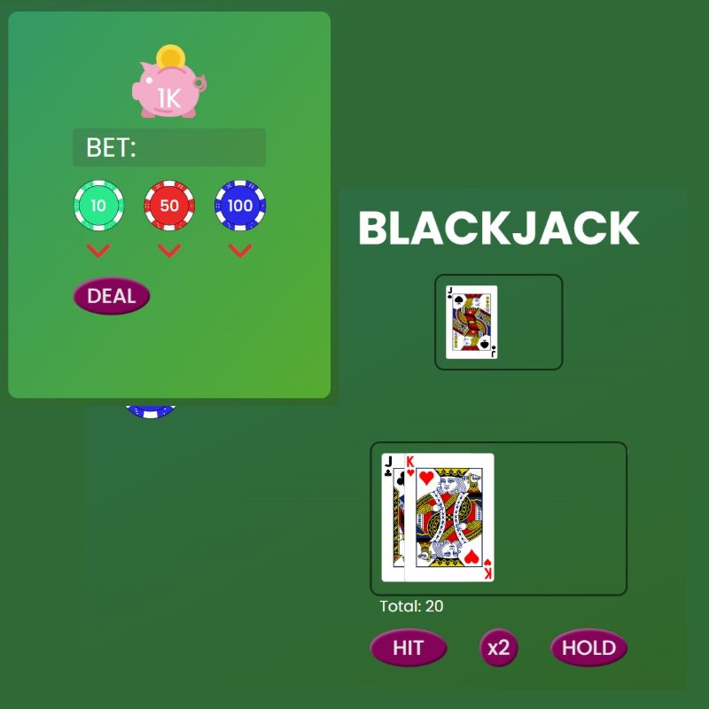

# JavaScript Exercise: Blackjack
I first began creating a Blackjack game the same week that I started learning JavaScript. It immediately came to mind as a good beginner project for several reasons. The game shares a similar logic structure to JavaScript as well as managing numerous values and conditions. It has given me good practice in creating functions and nesting them. It has also allowed me to explore objects in JavaScript and see how they work as parameters. The game's logic and image display aspects have recently been made functional, while betting is not. The project is nearing being finished, but there are a number of things left to be adjusted. 

## Features
- Game play area
- Player Class: For initializing player and dealer objects
	- This allows for methods to identify aspects of the player objects that are needed for gameplay.
-	Deck is treated as an array of objects. This allows tracking of numerous aspects
	- This includes a full svg deck
- The deck is shuffled using the Fisher-Yates method (with time complexity of O(n))
- Player can place bet, hit, hold, and double
- Dealer logic implements dealer's turn

## Badges

## Planned Features and Fixes 
- Split Function

## Contributor
Playtesting and Bug Locating 
[Samuel Reutecky](https://github.com/mr-reutcky)

### Preview 

### Image Attribution
[Harald Eicher](https://pixabay.com/users/teacherbingo-18391860/?utm_source=link-attribution&utm_medium=referral&utm_campaign=image&utm_content=7155166)  
[Pixabay](https://pixabay.com//?utm_source=link-attribution&utm_medium=referral&utm_campaign=image&utm_content=7155166)  
[Icon by TekEye](https://tekeye.uk/playing_cards/svg-playing-cards#google_vignette)
[Icon by Muhammad Haq](https://freeicons.io/business-collection-icon/piggy-bank-icon-22292) on [freeicons.io](https://freeicons.io)

### Sound Effect Attribution

Sound Effect by [freesound_community](https://pixabay.com/users/freesound_community-46691455/?utm_source=link-attribution&utm_medium=referral&utm_campaign=music&utm_content=104313) from [Pixabay](https://pixabay.com/sound-effects//?utm_source=link-attribution&utm_medium=referral&utm_campaign=music&utm_content=104313)

Sound Effect by [floraphonic](https://pixabay.com/users/floraphonic-38928062/?utm_source=link-attribution&utm_medium=referral&utm_campaign=music&utm_content=180438) from [Pixabay](https://pixabay.com/sound-effects//?utm_source=link-attribution&utm_medium=referral&utm_campaign=music&utm_content=180438)

Sound Effect by [floraphonic](https://pixabay.com/users/floraphonic-38928062/?utm_source=link-attribution&utm_medium=referral&utm_campaign=music&utm_content=188227) from [Pixabay](https://pixabay.com/sound-effects//?utm_source=link-attribution&utm_medium=referral&utm_campaign=music&utm_content=188227)

Sound Effect by [u_8g40a9z0la](https://pixabay.com/users/u_8g40a9z0la-45586904/?utm_source=link-attribution&utm_medium=referral&utm_campaign=music&utm_content=234708) from [Pixabay](https://pixabay.com//?utm_source=link-attribution&utm_medium=referral&utm_campaign=music&utm_content=234708)

Image by [Mostafa Elturkey](https://pixabay.com/users/mostafaelturkey36-13328910/?utm_source=link-attribution&utm_medium=referral&utm_campaign=image&utm_content=4757693) from [Pixabay](https://pixabay.com//?utm_source=link-attribution&utm_medium=referral&utm_campaign=image&utm_content=4757693)

Sound Effect by [freesound_community](https://pixabay.com/users/freesound_community-46691455/?utm_source=link-attribution&utm_medium=referral&utm_campaign=music&utm_content=101296) from [Pixabay](https://pixabay.com/sound-effects//?utm_source=link-attribution&utm_medium=referral&utm_campaign=music&utm_content=101296)
